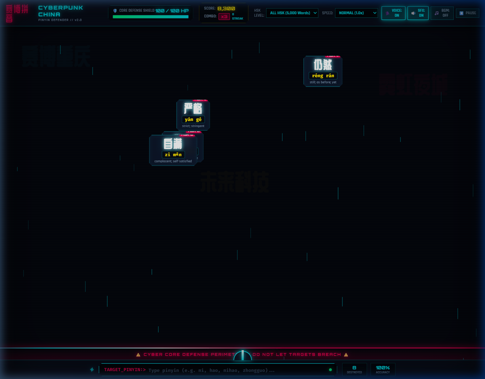

# 赛博拼音 // CYBERPUNK CHINA: PINYIN DEFENDER

An intense, retro-futuristic Cyberpunk Chinese typing arcade game. Chinese words fall from the cyber sky towards your city's defense perimeter. Type the exact Pinyin to lock-on and vaporize each target with laser cannons before they breach your 100 HP Core Shield!



---

## ⚡ Features

- **5,000 Common Chinese Words Library (HSK 1-6)**:
  - Standard vocabulary dataset embedded in `words.js`.
  - Filter by level: All HSK (5,000 words), HSK 1 (150 words), HSK 2 (150 words), HSK 3 (300 words), HSK 4 (600 words), HSK 5 (1,300 words), HSK 6 (2,500 words).
  - Displays Chinese Hanzi, accented Pinyin, and English/Vietnamese meaning.
- **100 HP Core Shield Mechanic**:
  - The player starts with 100 HP.
  - Each falling word touching the ground damages your shield by **-1 HP**.
  - Dynamic screen shake, neon red damage strobe, and warning alarms when HP < 25.
  - Game Over screen with detailed stats when HP reaches 0.
- **Fluid Pinyin Typing & Laser Targeting**:
  - Accepts toneless pinyin (e.g. `ni`, `hao`, `nihao`, `zhongguo`) or numbered pinyin (`ni3hao3`).
  - Auto-highlights matched pinyin prefix in real-time.
  - Rotating cyber cannon turret tracks and locks onto the lowest active target.
  - Instant laser fire + glowing particle explosion upon exact match.
- **Native Mandarin Voice Pronunciation (TTS)**:
  - Pronounces each destroyed Chinese word aloud in native Mandarin (`zh-CN` via Web Speech API) to reinforce auditory learning.
- **Procedural Web Audio API Synthesizer**:
  - Laser blast sweeps, explosion booms, mechanical keystrokes, shield damage clangs, and ambient Chinese pentatonic synthwave arpeggio drone.
- **Difficulty & Speed Customization**:
  - Relaxed (0.75x), Normal (1.0x), Netrunner (1.4x), Overdrive (2.0x).
- **Combos & Scoring**:
  - Successive hits build combos (x1, x2, x3, x4, x5 OVERDRIVE) multiplying your score.

---

## 🚀 Quick Start

No build tools or external dependencies needed! Simply open `index.html` in any modern web browser or serve it locally:

```bash
# Using Python
python -m http.server 8080

# Or using Node.js
npx serve .
```

Visit [http://localhost:8080](http://localhost:8080).

---

## 🎮 How to Play

1. Click **"INITIALIZE CANNON & START DEFENSE"**.
2. Words with Hanzi, Pinyin, and meanings will drop from the sky.
3. Type the Pinyin of any falling word into the bottom console.
4. When the pinyin is complete, your laser cannon shoots and destroys the word!
5. Protect your **100 HP** shield from being breached!

---

## 📁 Project Structure

```
├── index.html                  # Cyberpunk HUD, sky arena, cannon turret & modals
├── style.css                   # Cyberpunk Chinese neon aesthetics, animations & CRT FX
├── words.js                    # 5,000 Common Chinese words library (HSK 1-6)
├── audio.js                    # Web Audio synthesizer & Mandarin speech engine (TTS)
├── game.js                     # Core physics, laser targeting, 100 HP shield & game loop
├── generate_words_dataset.py   # Python generator used to compile the 5,000 words
├── preview.png                 # Game screenshot
└── README.md                   # Documentation
```

---

## 📜 License

MIT License. Crafted with ❤️ for Chinese language learners and cyberpunk enthusiasts.
