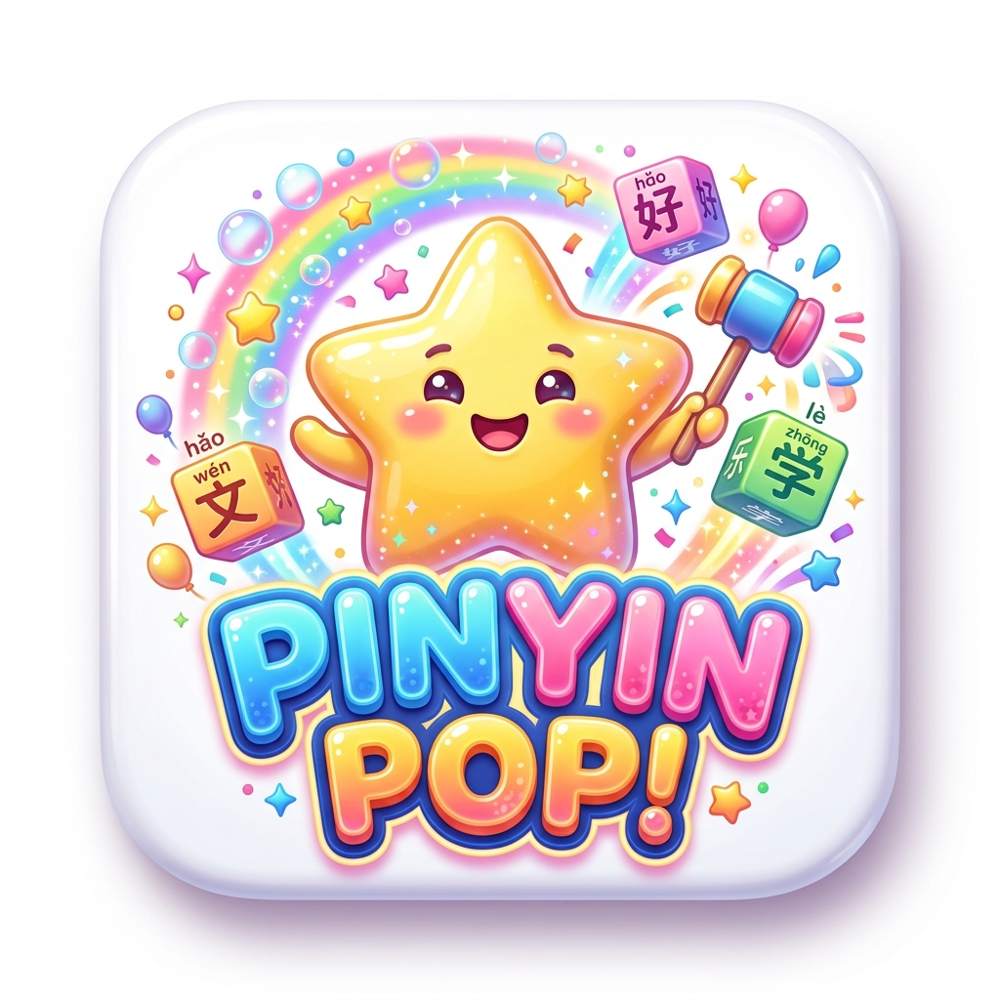

# 🌟 PINYIN POP! // 快乐拼音 - Vui Học Tiếng Trung 5000 Từ HSK

Trò chơi luyện gõ Pinyin tiếng Trung phong cách kẹo ngọt vui nhộn, sống động! Các bong bóng từ vựng tiếng Trung rơi nhẹ nhàng từ bầu trời cầu vồng. Gõ chính xác phiên âm Pinyin để pháo sao bắn nổ từ vựng, tích điểm combo và bảo vệ 100 Tim năng lượng!

<p align="center">
  
</p>

---

## ⚡ Tính Năng Nổi Bật / Key Features

- **Giao Diện Candy Pop Vui Tươi & Sống Động**:
  - Tông màu kẹo ngọt rực rỡ, mây bồng bềnh lơ lửng, bong bóng cầu vồng và các vì sao lấp lánh.
  - Các thẻ bài từ vựng thiết kế dạng viên kẹo tròn trịa, hiệu ứng pháo giấy confetti lung linh khi bắn trúng!
- **5.000 Từ Vựng Tiếng Trung Chuẩn HSK 1 - 6 (Đầy đủ Chú thích Tiếng Việt & Tiếng Anh)**:
  - Bộ dữ liệu từ vựng tích hợp sẵn trong `words.js`.
  - Hỗ trợ bộ lọc: Toàn bộ HSK (5.000 từ), HSK 1 (150 từ), HSK 2 (150 từ), HSK 3 (300 từ), HSK 4 (600 từ), HSK 5 (1.300 từ), HSK 6 (2.500 từ).
  - Tùy chọn hiển thị chú thích nghĩa: **🇻🇳 Tiếng Việt**, **🇻🇳🇬🇧 Song ngữ**, hoặc **🇬🇧 Tiếng Anh**.
- **Thang Điểm Theo Cấp Độ HSK (HSK Tier Scoring)**:
  - Càng từ vựng HSK cấp cao càng nhận được nhiều điểm thưởng:
    - **HSK 1**: 100 điểm
    - **HSK 2**: 250 điểm
    - **HSK 3**: 500 điểm
    - **HSK 4**: 1.000 điểm
    - **HSK 5**: 2.000 điểm
    - **HSK 6**: 4.000 điểm
  - Kết hợp hệ số nhân Chuỗi Combo (x1, x2, x3, x4, x5 SIÊU TỐC) mang lại điểm số bùng nổ!
- **Nút Bật / Ẩn Pinyin Nổi Bật (Chế Độ Luyện Trí Nhớ Chữ Hán)**:
  - Nút chuyển đổi Pinyin nổi bật trên thanh điều khiển HUD:
    - **👁️ PINYIN: HIỆN**: Hiển thị đầy đủ phiên âm Pinyin.
    - **🙈 PINYIN: ẨN (THỬ THÁCH)**: Ẩn/làm mờ Pinyin để tự nhớ mặt chữ Hán.
    - Phím tắt nhanh: **F2** hoặc **Alt + P**.
- **Âm Thanh Game Vui Nhộn & Giọng Đọc Bản Ngữ (TTS)**:
  - Tự động phát âm chuẩn giọng Bắc Kinh (`zh-CN`) mỗi khi bắn hạ từ vựng.
  - Hiệu ứng âm thanh sinh động, vui tươi kèm nhạc nền chiptune bắt tai.
- **Hệ Thống Thẻ Ghi Nhớ Flashcard Thông Minh (`flashcard.html`)**:
  - **Thẻ 3D Flip Card tương tác mượt mà**: Lật thẻ để xem Chữ Hán, Pinyin chuẩn thanh điệu, Nghĩa tiếng Việt & tiếng Anh.
  - **Phân bài học theo Deck (25 từ/bài)**: Dễ dàng chia nhỏ 5.000 từ vựng thành các bài học nhỏ để ghi nhớ nhẹ nhàng không áp lực.
  - **Cơ chế Active Recall (Ghi nhớ chủ động)**: Đánh dấu `❌ Chưa thuộc` và `✅ Đã thuộc` được lưu trữ tự động vào `localStorage` kèm thanh tiến độ.
  - **3 Chế độ học linh hoạt**:
    - 🗂️ **Học Flashcard**: Lật thẻ tự do, xáo trộn (Shuffle), tự động lật (Slideshow).
    - 🎯 **Trắc nghiệm (Quiz)**: Luyện tập 4 đáp án thử thách phản xạ.
    - 📜 **Từ điển tổng hợp (Dictionary Grid)**: Tra cứu nhanh toàn bộ từ kèm phát âm chuẩn Bắc Kinh.
  - **Phát âm giọng bản ngữ (TTS)**: Tự động phát âm hoặc nhấp vào loa 🔊 bất kỳ lúc nào.
- **Game Ghép Bộ Thủ & Từ Ghép (`hanzi-puzzle.html`)**:
  - **Chế độ Ghép Bộ Thủ Cội Nguồn (Radical Decomposer)**:
    - Kéo thả các bộ thủ rời rạc (`亻`, `木`, `日`, `月`, `氵`, `讠`, `氵`, `女`...) để ghép thành chữ Hán hoàn chỉnh.
    - Thẻ kiến thức mở rộng (Etymology Card) trực quan sau khi hoàn thành, giải thích nguồn gốc, văn hóa hình thành chữ Hán.
  - **Chế độ Ghép Từ Ghép HSK 1 - 6 (Compound Word Builder)**:
    - Khai thác trọn vẹn **kho 5.000 từ vựng HSK** trong `words.js`.
    - Thử thách ghép các chữ đơn lẻ thành từ ghép chuẩn HSK kèm nghĩa tiếng Việt & phiên âm Pinyin.
  - **Tương tác linh hoạt & mượt mà**: Hỗ trợ đồng thời kéo thả (Drag & Drop) và nhấp chọn (Click-to-slot) cực kỳ thuận tiện trên cả máy tính lẫn điện thoại/tablet.
  - **Âm thanh hiệu ứng & Phát âm TTS**: Tự động phát âm chuẩn giọng Bắc Kinh khi ghép đúng.
- **Trò Chơi Vua Thanh Điệu & Phòng Luyện Âm Tiếng Trung (`tone-master.html`)**:
  - **🎮 Thử Thách Thính Giác (Tone Ear Challenge)**:
    - Phân biệt chuẩn xác **4 Thanh điệu tiếng Trung Bắc Kinh** (1 Âm Bình 55, 2 Dương Bình 35, 3 Thượng Thanh 214, 4 Khứ Thanh 51).
    - 4 Pad bấm thanh điệu cỡ lớn hiển thị trực quan sơ đồ cao độ SVG, hỗ trợ phím tắt nhanh `1, 2, 3, 4` và phím `R` để nghe lại âm thanh.
    - Chế độ **Cặp từ đối lập (Minimal Pairs)** phân biệt các từ phát âm gần giống nhau (như `买` mǎi vs `卖` mài, `十` shí vs `是` shì).
    - Chế độ **Thử thách biến điệu (Sandhi Quiz)** luyện phản xạ quy tắc biến điệu thực tế.
  - **🎙️ Bảng Phát Âm 21 Thanh Mẫu & 36 Vận Mẫu (Mandarin Phonetics Lab)**:
    - Phân loại khoa học 21 Thanh Mẫu theo vị trí cấu âm (hai môi, môi răng, đầu lưỡi, gốc lưỡi, mặt lưỡi, uốn lưỡi).
    - Nhận biết rõ ràng thuộc tính **BẬT HƠI** (luồng khí mạnh) vs **KHÔNG BẬT HƠI**.
    - Bảng 36 Vận Mẫu (Đơn, Kép, Mũi, Cuốn lưỡi) tích hợp sẵn nút phát âm đầy đủ 4 thanh điệu cho từng vần (`ā, á, ǎ, à`...).
  - **📈 Bí Kíp Biến Điệu & Quy Tắc Thanh Điệu (Tone Sandhi & Rules Guide)**:
    - Hướng dẫn trực quan quy tắc 2 thanh 3 (`3 + 3 ➔ 2 + 3`), biến điệu chữ `不` (bù ➔ bú), biến điệu chữ `一` (yī ➔ yí / yì) và Khinh thanh (Neutral tone) kèm audio minh họa riêng.
- **Cơ Chế 100 Tim Năng Lượng Trong Game**:
  - Người chơi khởi đầu với 100 Tim năng lượng. Giữ tim càng lâu, combo càng bùng nổ!

---

## 🚀 Hướng Dẫn Chạy Dự Án / How to Run

Dự án là ứng dụng Web Frontend thuần (**HTML5, CSS3, JavaScript ES6**), **không cần cài đặt dependencies nặng hay build bundle (npm build / webpack)**.

### 1️⃣ Khởi Chạy Bằng Local Server (Khuyên dùng)

Chạy qua Local Server giúp trình duyệt hỗ trợ tốt nhất các tính năng Web Audio API, Canvas, giọng đọc TTS và tránh hạn chế CORS.

#### 🐍 Cách A: Sử dụng Python
Mở cửa sổ dòng lệnh (Terminal / PowerShell / Command Prompt) tại thư mục dự án và chạy:
```bash
python -m http.server 8080
```
Sau đó truy cập: **[http://localhost:8080](http://localhost:8080)**

#### 🟢 Cách B: Sử dụng Node.js (npx)
Nếu máy tính đã cài đặt Node.js:
```bash
# Dùng serve
npx serve -l 8080 .

# Hoặc dùng http-server
npx http-server -p 8080
```
Sau đó truy cập: **[http://localhost:8080](http://localhost:8080)**

#### 💻 Cách C: Sử dụng VS Code Live Server
Nếu bạn đang dùng Visual Studio Code hoặc Cursor:
1. Cài đặt tiện ích mở rộng **Live Server** (của Ritwick Dey).
2. Nhấp chuột phải vào file [`index.html`](index.html) ➔ Chọn **"Open with Live Server"**.

### 2️⃣ Mở Trực Tiếp Trên Trình Duyệt (Direct File)
Nhấp đúp chuột trực tiếp vào file [`index.html`](index.html) để mở trên Google Chrome, Microsoft Edge, Brave hoặc Firefox.

---

### 🗺️ Bảng Điều Hướng & Các Trang Trong Dự Án

| Trang | File | Đường dẫn Local Server | Chức năng nổi bật |
| :--- | :--- | :--- | :--- |
| 🌟 **Cổng Trung Tâm & Pinyin Pop** | [`index.html`](index.html) | `http://localhost:8080/index.html` | Menu tổng hợp & Trò chơi gõ Pinyin Arcade HSK 1 - 6 |
| ✍️ **Tập Viết Chữ Hán** | [`hanzi-stroke.html`](hanzi-stroke.html) | `http://localhost:8080/hanzi-stroke.html` | Luyện viết theo thứ tự bút thuận chuẩn HSK, lưới Mễ Điền (米字格) |
| 🗂️ **Thẻ Flashcard 3D** | [`flashcard.html`](flashcard.html) | `http://localhost:8080/flashcard.html` | Học 5.000 từ chia bài 25 từ/deck, Active Recall & Quiz 4 đáp án |
| 🧩 **Ghép Bộ Thủ & Ghép Từ** | [`hanzi-puzzle.html`](hanzi-puzzle.html) | `http://localhost:8080/hanzi-puzzle.html` | Kéo thả ghép bộ thủ tạo chữ & ghép từ vựng HSK |
| 🎵 **Vua Thanh Điệu** | [`tone-master.html`](tone-master.html) | `http://localhost:8080/tone-master.html` | Luyện nghe 4 thanh điệu, bảng 21 thanh mẫu & 36 vận mẫu |

---

## 🎮 Cách Chơi / How to Play

1. Nhấp nút **"KHỞI ĐỘNG PHÁO LASER & BẮT ĐẦU PHÒNG THỦ"** (âm thanh sẽ tự động bật).
2. Các từ vựng tiếng Trung kèm Pinyin và nghĩa tiếng Việt sẽ rơi dần từ trên xuống.
3. Gõ Pinyin của bất kỳ từ nào vào khung console bên dưới (gõ không dấu, ví dụ: `ni`, `hao`, `nihao`, `zhongwen`).
4. Khi gõ đủ chữ, pháo laser sẽ lập tức khai hỏa tiêu diệt từ mục tiêu, cộng điểm và phát âm tiếng Trung.
5. Muốn thử thách ghi nhớ chữ Hán? Nhấp nút **"PINYIN: HIỆN"** trên thanh công cụ để chuyển sang chế độ **ẨN PINYIN**!

---

---

## ☁️ Đồng Bộ Tiến Độ Đa Thiết Bị (Supabase Cloud Sync)

PINYIN POP! tích hợp sẵn hệ thống **Đăng Nhập / Đăng Ký** và đồng bộ tiến độ học tập giữa **Máy Tính** và **Điện Thoại** hoàn toàn **MIỄN PHÍ 100%** thông qua **Supabase (PostgreSQL Cloud)**.

### ✨ Ưu Điểm:
- **Tốc độ cực cao & Không tốn phí máy chủ**: Render vẫn giữ nguyên dạng Static Web, trình duyệt kết nối trực tiếp đến Supabase Database qua kết nối mã hóa SSL.
- **Hỗ trợ chế độ Offline / Khách (Guest)**: Người học chưa đăng nhập vẫn sử dụng đầy đủ mọi tính năng bình thường qua `localStorage`.
- **Hợp nhất dữ liệu thông minh**: Khi đăng nhập, tiến độ học trên máy tính và điện thoại được tự động gộp lại mà không sợ mất thẻ đã thuộc hay chữ Hán đã viết.

### 🛠️ Hướng Dẫn Kích Hoạt Supabase Trong 1 Phút:
1. Đăng ký tài khoản miễn phí tại **[https://supabase.com](https://supabase.com)** và tạo một **New Project**.
2. Tại thanh điều hướng bên trái, vào mục **SQL Editor** ➔ bấm **New query**.
3. Mở file [`supabase_schema.sql`](supabase_schema.sql) trong dự án, sao chép toàn bộ nội dung và dán vào SQL Editor, sau đó bấm **RUN** (hoặc nhấn `Ctrl + Enter`).
4. Vào mục **Project Settings** (biểu tượng bánh răng) ➔ chọn **API**:
   - Sao chép **Project URL**.
   - Sao chép **Project API Keys (anon / public)**.
5. Có 2 cách kích hoạt:
   - **Cách 1 (Nhanh nhất - Không cần sửa code)**: Mở trang web PINYIN POP! ➔ bấm nút **"☁️ Đăng Nhập"** ở góc trên ➔ chọn tab **"⚙️ Cấu Hình"** ➔ dán URL và Anon Key vào rồi bấm **"Lưu Cấu Hình"**.
   - **Cách 2 (Cố định vào mã nguồn)**: Mở file `supabase-config.js` và điền URL & Anon Key vào:
     ```javascript
     window.SUPABASE_CONFIG = {
       url: 'https://xyzabcdefg.supabase.co',
       anonKey: 'eyJhbGciOiJIUzI1NiIsInR5cCI6IkpXVCJ9...'
     };
     ```
6. Bạn và người học có thể tạo tài khoản và đăng nhập ngay để tiến độ luôn đồng bộ trên mọi thiết bị!

---

## 📁 Cấu Trúc Dự Án / Project Structure

```
├── assets/
│   ├── logo.png                # Mascot Logo 3D Pinyin Pop
│   └── audio/                  # Các file âm thanh 8-bit (laser, explosion, coin, bgm...)
├── index.html                  # 🌟 Cổng Menu Trung Tâm (Game & Flashcard Hub)
├── pinyin-pop.html             # 🎮 Game Bắn Chữ Arcade Pinyin Pop (HSK 1 - 6)
├── flashcard.html              # 🗂️ Thẻ Ghi Nhớ Flashcard 3D, Trắc Nghiệm Quiz & Từ Điển
├── flashcard.css               # Phong cách thẻ 3D Flip Card và bộ học tập
├── flashcard.js                # Logic Flashcard, lọc bài theo Deck & đồng bộ Cloud
├── hanzi-puzzle.html           # 🧩 Game Ghép Bộ Thủ Cội Nguồn & Ghép Từ Ghép HSK 1 - 6
├── hanzi-puzzle.css            # Giao diện kéo thả Puzzle Candy Pop hiện đại
├── hanzi-puzzle.js             # Logic ghép chữ & lưu kỷ lục điểm số
├── tone-master.html            # 🎵 Vua Thanh Điệu & Bảng 21 Thanh Mẫu / 36 Vận Mẫu
├── tone-master.css             # Giao diện âm thanh, 4 pad thanh điệu & bảng ngữ âm
├── tone-master.js              # Bộ mô phỏng cao độ thanh điệu & nhận diện âm thanh
├── hanzi-stroke.html           # ✍️ Tập Viết Chữ Hán Theo Quy Tắc Bút Thuận Chuẩn HSK
├── hanzi-stroke.css            # Giao diện ô Mễ Điền (米字格) & tương tác nét vẽ di động
├── hanzi-stroke.js             # Bộ điều khiển nét bút HanziWriter & đồng bộ tiến độ
├── auth-modal.css              # Giao diện Popup Đăng Nhập, Đăng Ký & Profile Candy Pop
├── auth-modal.js               # Điều khiển Modal Auth & nút trạng thái đồng bộ Navbar
├── supabase-config.js          # File cấu hình URL & API Key Supabase Cloud
├── supabase-client.js          # Bộ máy đồng bộ 2 chiều (Cloud Sync Engine) & xác thực
├── supabase_schema.sql         # Kịch bản tạo bảng Database (PostgreSQL RLS) trên Supabase
├── style.css                   # Thiết kế Candy Pop sống động, font chữ Noto Sans SC thanh mảnh
├── words.js                    # Thư viện 5.000 từ vựng tiếng Trung HSK 1-6 chuẩn nghĩa tiếng Việt
├── audio.js                    # Bộ phát âm thanh 8-bit, chiptune BGM sequencer & TTS bản ngữ
├── game.js                     # Logic game Pinyin Pop, tính điểm HSK, bắn sao & confetti
├── preview.png                 # Ảnh chụp màn hình trò chơi
└── README.md                   # Tài liệu hướng dẫn
```

---

## 👨‍💻 Tác Giả & Bản Quyền / Author & Copyright

- **Tác giả / Author**: **Khai Le** (Le Quang Khai)
- **Bản quyền / Copyright**: © 2026 **Khai Le**. All Rights Reserved.
- **Giấy phép / License**: MIT License.

---

